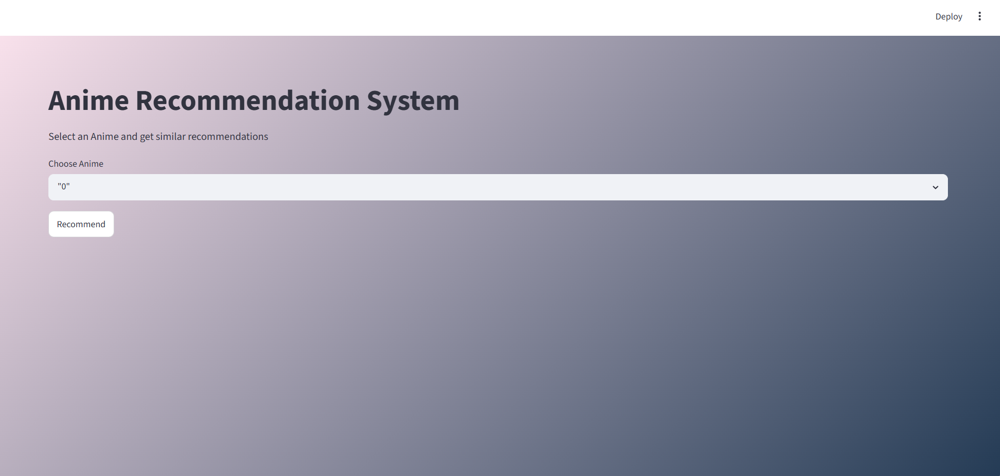
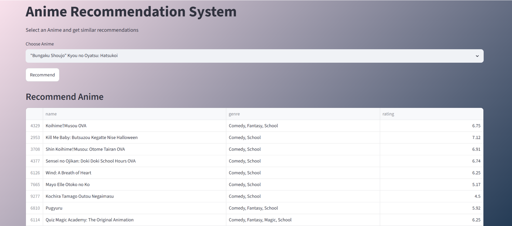

# Anime_Recommendation_System

#### Project Overview

This project develops an Anime Recommendation System using a Content-Based Filtering approach. The system recommends anime titles based on similarity between anime attributes such as genre and type.

Unlike collaborative filtering, this approach does not depend on user interaction history and instead generates recommendations by identifying similar content characteristics.

The project includes:

* Data loading and preprocessing
* Exploratory Data Analysis (EDA)
* Missing value handling
* Distribution and skewness analysis
* Feature engineering
* TF-IDF vectorization
* Cosine similarity computation
* Model serialization using Joblib
* Streamlit web application deployment

#### Dataset

Two datasets were used:
##### 1. anime.csv
contains anime-related information:
* anime_id
* name
* genre
* type
* episodes
* rating
* members

##### 2. rating.csv
contains user rating:
* user_id
* anime_id
* rating

##### Note:
This project follows a Content-Based Recommendation approach, therefore the recommendation logic primarily uses anime metadata instead of user rating interactions.

#### Objective
Build a recommendation engine capable of suggesting anime titles similar to a selected anime using textual content similarity.

#### Technologies Used

* Python
* Pandas
* NumPy
* Matplotlib
* Seaborn
* Scikit-Learn
* Joblib
* Streamlit

#### Exploratory Data Analysis(EDA)
The following analysis was performed:

##### Missing Value Treatment
* Genre → Filled with "Unknown"
* Type → Filled using Mode
* Rating → Filled using Median

##### Visualizations
* Distribution of Anime Types
* Rating Distribution
* Top Genres
* Most Popular Anime

##### Skewness Analysis
Skewness was calculated for numerical variables
Result:
* Members column showed strong positive skewness
Log Transformation was applied

#### Recommendation System Workflow
Step 1 :  Feature Engineering

Combined:
Genre + Type

Example:
Comedy TV

Step 2: TF-IDF Vectorization
Text features converted into numerical vectors.

Step 3: Cosine Similarity
Calculated similarity between anime vectors.

Step 4: Recommendation Generation
Returns top similar anime titles.

#### Streamlit Interface

Features:

* Select anime from dropdown
* Generate recommendations
* Display:
     Anime Name
     Genre
     Rating

